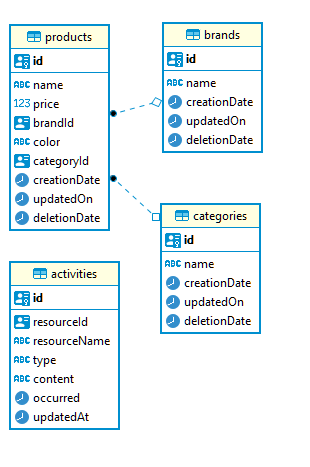

# NAB Code Challenge

## Requisites
- docker (tested on **v20.10.8**) and docker-compose (tested on **v1.29.2**)

### If you want to run locally
- node version >= 12 (tested and run on **v12.18.3**)
- yarn

## Steps to run
- Clone this repo https://github.com/psontra/nabcodechallenge.git
- Make sure you are at the same directory as `docker-compose.yaml`
- Run `docker-compose up`

### If you want to run locally
- Must use `yarn`
- Make sure you are at the same directory as `docker-compose.yaml`
- Run `docker-compose up db`
- Open 2 terminals
- `cd` to **apps/api**
  - Run `yarn install`
  - Run `yarn start`
- `cd` to **apps/activityService**
  - Run `yarn install`
  - Run `yarn start`

## Run unit test
- Must use `yarn`
- Can only run unit test for each service (`api/activity service`), cannot run both with 1 command.
- `cd` to **apps/api**
  - Run `yarn install` if you haven't
  - Run `yarn test` or `yarn test:cov` to see coverage
- `cd` to **apps/activityService**
  - Run `yarn install` if you haven't
  - Run `yarn test` or `yarn test:cov` to see coverage  

## Details of project
- You can test endpoint using `curl` command (examples at [CURL commands examples to test endpoints](#curl-commands-examples-to-test-endpoints))
- Or you can import the collection from **postman/NAB Code Challenge.postman_collection.json** to ``Postman` and test.

### High-level design and infrastructure

- And a `swagger` service to show the endpoint documents of `api`.
- `api` can contact with `activity-service` via HTTP calls to public endpoints of `activity-service`

### Swagger document endpoint
- If run by `docker-compose`:
```
http://localhost:8080/api-docs
```
- If run locally:
```
http://localhost:3000/api-docs
```
- Currently, I have only created swagger document page for `api`

### Sequence diagram for get product list


- Every time user requests to get product list, an activity will be logged, you can request to get list activities to check after the call to get product list:
```
  curl "http://localhost:3001/activities"
```

### Entity relationship diagram for the database.


### Software development principles, patterns & practices being applied
- Repository pattern
- Dependency injection (using **InversifyJS**)

### Code folder structure
- Group by layer (`controller/service/repository/...`)
- Has 2 services inside `apps` folder due to the fact that I can only use 1 repository
```
├───apps
│   ├───activityService
│   │   └───<same with api>
│   └───api
│       └───src
│           ├───app
│           │   ├───common
│           │   │   ├───db
│           │   │   └───Ioc
│           │   ├───controllers
│           │   │   └───product
│           │   ├───models
│           │   ├───repositories
│           │   │   └───product
│           │   ├───routes
│           │   ├───services
│           │   │   ├───activity
│           │   │   └───product
│           │   ├───transformers
│           │   └───validators
│           ├───config
│           ├───app.ts
│           ├───routes.ts
│           └───__jest__
├───db
│   ├───init.sql
│   └───Dockerfile
├───postman
├───docker-compose.yaml
└───readme
```

### Libraries / frameworks being used
- ExpressJS
- InversifyJS
- Joi to validate request
- Jest to run unit test
- Winston to log
- Morgan to log requests
- Sequelize to interact with database (postgres)  
- Husky & lint-staged to add pre-commit hook to re-verify staged files.
- eslint, prettier to check code standard.
- `config` to read from pre-set configuration file.

## CURL commands examples to test endpoints
- Get list of products: read how to do advance search query at section [Advance search when get list of products](#advance-search-when-get-list-of-products)
  ```
  curl "http://localhost:3000/products/?name__contain=gigabyte&sortBy=price:asc"
  ```
- Get product detail
  ```
  curl "http://localhost:3000/products/edcf6c53-728f-4fa9-ab52-669a30cda0fb"
  ```
- Update product
  ```
  curl -X PUT "http://localhost:3000/products/edcf6c53-728f-4fa9-ab52-669a30cda0fb" \
  -H 'Content-Type: application/json' \
  -d '{
      "name": "updated product"
  }'
  ```
- Delete product
  ```
  curl -X DELETE "http://localhost:3000/products/edcf6c53-728f-4fa9-ab52-669a30cda0fb"
  ```
- Create product
  ```
  curl -X POST "http://localhost:3000/products" \
  -H 'Content-Type: application/json' \
  -d '{
      "name": "new product",
      "price": "12345",
      "brandId": "249176ea-24d8-40e5-a729-fab46430986c",
      "categoryId": "aa4ef1f7-7956-43cd-9b28-cf921e249c51"
  }'
  ```
- Get all activities
  ```
  curl "http://localhost:3001/activities"
  ```
  
## Advance search when get list of products
- Endpoint `/products`: 
  - Support the following queries:
    - name: name of product - string
    - price: price of product - number
    - color: color of product - string  
    - brandId: brand id that product belongs to - string (uuid v4)
    - categoryId: category id that product belongs to - string (uuid v4)
    - sortBy: set sort order of product list
  - How to use operators to query:     
    - Current support operators: 
        - `eq`: equal
        - `lt`: less than
        - `lte`: less than equal
        - `gt`: greater than
        - `gte`: greater than equal
        - `contain`: contain in text
    - Syntax: append `__<operator>` next to field name, Ex: name__contain=gigabyte means to query **name** field that contains `gigabyte` keyword.
  - How to use sort by query to sort list of product:
    - Syntax: `sortBy=<fieldName>:asc|desc`
        - Sample CURL command: 
          ```
          curl "http://localhost:3000/products/?name__contain=gigabyte&sortBy=price:asc"
          ```
  - **Note**: if no operator is provided, the default operator `eq` is used.
